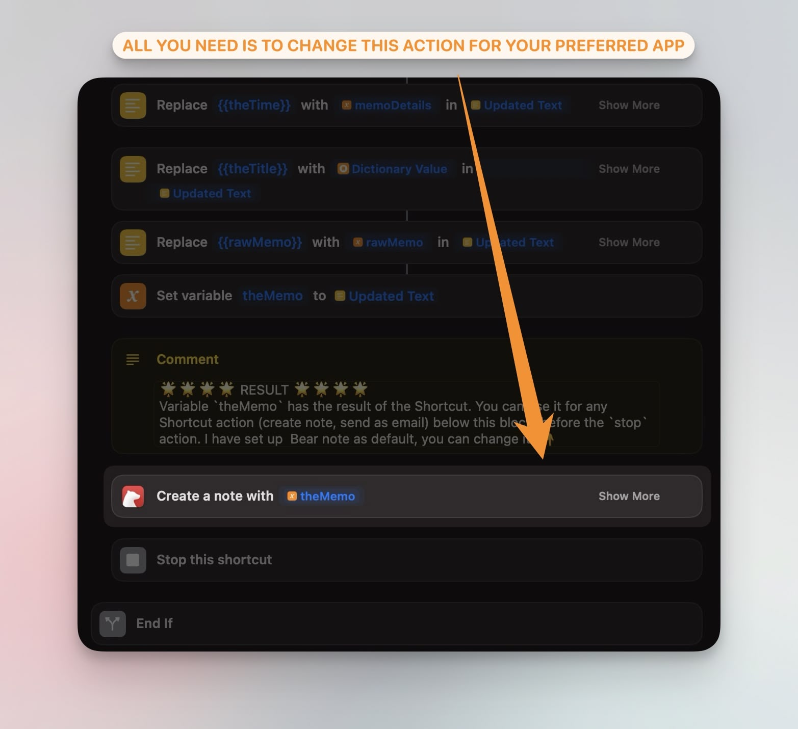
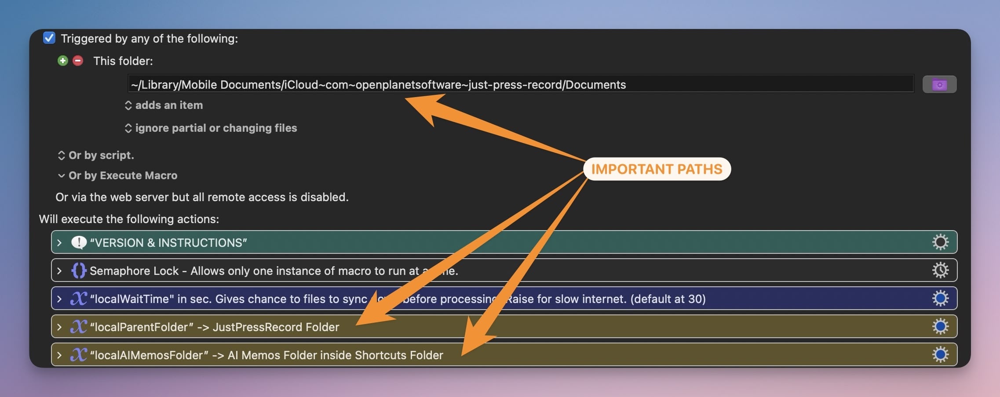

# AI MEMOS
**AI Memos is a powerful automation that allows you to capture ideas, take notes, and create content effortlessly using voice dictation.** It combines the ease of recording with Just Press Record, the accuracy of OpenAI's Whisper for transcription, and the processing power of LLM models for text refinement. With AI Memos, you can dictate on any Apple device and have your thoughts automatically transcribed, processed, and added to your preferred note-taking app. This tool is perfect for anyone who wants to streamline their note-taking process, capture fleeting ideas, or create content on-the-go without the hassle of manual transcription or editing.

## REQUIREMENTS
1. OpenAI API token ([SIGN UP HERE](https://platform.openai.com/signup) | [GET IT HERE](https://platform.openai.com/api-keys))
2. [Keyboard Maestro](https://www.keyboardmaestro.com/main/) with the [latest AI Memos macro](https://github.com/ognistik/km-ai-memos/releases/latest)
3. Latest [AI Memos Shortcut](https://github.com/ognistik/km-ai-memos/releases/latest)
4. [Just Press Record](https://www.openplanetsoftware.com/just-press-record/)

---
## SETUP
### Shortcut Setup
1. Insert your OpenAI API token in the Shortcut setup.
2. If you use Bear, you can test the Shortcut immediately by dictating a note WITH THE SHORTCUT.
3. If you don't use Bear, modify the Shortcut to use your preferred note-taking app that integrates with Shortcuts.
4. Run the Shortcut once with a short transcription to ensure it's working correctly.

  

### Optional Shortcut Configuration
- Add Anthropic API token for alternative models
- Modify note templates
- Adjust history limits (Note: Processed files are moved to the history folder. When the limit is reached in the history folder, the oldest file will be moved to trash)
- Customize the included prompt
- Change the voice command for AI assistant mode (make sure to maintain the regex pattern)

### Keyboard Maestro Setup
1. This should work out of the gate, but ensure the correct location of the Just Press Record folder on iCloud for automatic triggering.
2. The macro can be triggered manually if preferred. In this case, the macro will process oldest all the audio files starting from the oldest.
3. You must run the macro manually once for the creation of the necessary files and directory structure in the Shortcuts/AI Memos folder.
4. Set up any text replacements in the `replacements.json` file in the Shortcuts/AI Memos Folder. Replacements are case-dependent.
5. Go ahead and [record with Just Press Record](#using-ai-memos)!

---
## ADDITIONAL NOTES
- Ensure the AI Memos folder in Shortcuts and the JustPressRecord folder are set to "Keep Downloaded" on both Mac and iOS devices to avoid sync issues.
- It is suggested you set your system to wake for network access. Then, even if you are out and about, you'll still receive your transcription whenever iCloud sync happens. Though it is slower than when your Mac is awake, I still find I receive my notes after a few minutes.
- **This automation uses JustPressRecord for its reliable recording and synchronization features only, not for transcription**. You may deactivate the built-in transcription feature in JustPressRecord settings.
- If you are feeling adventurous, I've color-coded the voice command actions in green inside the KM macro. You can simply duplicate the "Help Me" block and setup custom voice commands to be used with different AI System Prompts!

---
## Using AI Memos
**In actual use, AI Memos is as simple as recording with Just Press Record in any Apple device.** Then, just wait a bit and as soon as your system detects the audio file, it will transcribe it. It also works fine for multiple audio files, even if they are all synced at once. **If your file was processed but you don't see it as a note, make sure you are not in List Mode.**

### List Mode
- Can be activated by voice command or directly through the Shortcut
- Once you are in List Mode, all subsequent dictations will continue to be added to your list (a txt file in the AI Memos folder) until you process it. 
- You can pause, resume, or process your list, both by voice commands or with the Shortcut.

### Voice Commands
You may start your audio recording with the following commands:
- "Start list"
- "Pause list"
- "Resume list"
- "Process list"
- "Cancel list" - will only work if you haven't added items to your list. In such a case, you can cancel the list with the Shortcut
- "Help me" or "Listen" to dictate an AI Assistant kind of request.

**All voice commands—except for "Help me" or "Listen"—can be dictated alone or with additional content.** For example, you can say "Start list" followed by your text, and everything after "Start list" will be added to the list. Similarly, you can say "Process list," and any text you dictate after that will be processed as a separate note, not as part of the list. There are more options for ongoing or paused lists in the Shortcut, but these only work if your files have synced properly to your device.

## Troubleshooting
* If you record something on your watch but an audio file did not automatically sync to iCloud, you can do another recording to trigger the sync, or simply open Just Press Record on your iPhone for a second. This happens occasionally with the watch app only.
* If you can record and transcribe with the Shortcut alone. If you see your audio file synced in the Just Press Record folder but the automation is not working properly, it's very likely the issue has to do with the KM macro.

  

1. Ensure that the macro is being triggered automatically. If not, it means that the folder trigger is not pointing to the correct location.
2. Ensure that the yellow-colored actions are pointing both to the JPR folder, and to the AI Memos folder in the Shortcuts folder. Note that the paths do not start with `~`, this is set at the scripts level.
3. The blue/purple action block is the waiting time value which is related to your Internet connection. Keyboard Maestro will only be triggered when a file or folder is detected at the base level, but Just Press Record places files in subfolders. So, Keyboard Maestro detects the folder creation from JPR and waits then X amount of seconds for a file to appear.
   - Default: 30 seconds
   - Faster/Stable internet: Can be reduced (in the video sample above I had it at 5 seconds)
   - Slower internet: May need to be increased

## Closing
One of my main uses for this automation is capturing highlights from physical books. You can read more about how I use it with Readwise on my Substack. But I also use it all the time when I'm walking, driving, or going about my day and need a quick way to capture thoughts. I hope many of you find this useful. 

If you have any issues, ideas, or want to contribute, please open an issue on GitHub. I'm always happy to hear your feedback. I'm not making any money from this tool, so if you find it helpful, I'd be incredibly grateful if you'd [buy me a coffee](https://buymeacoffee.com/afadingthought)!

